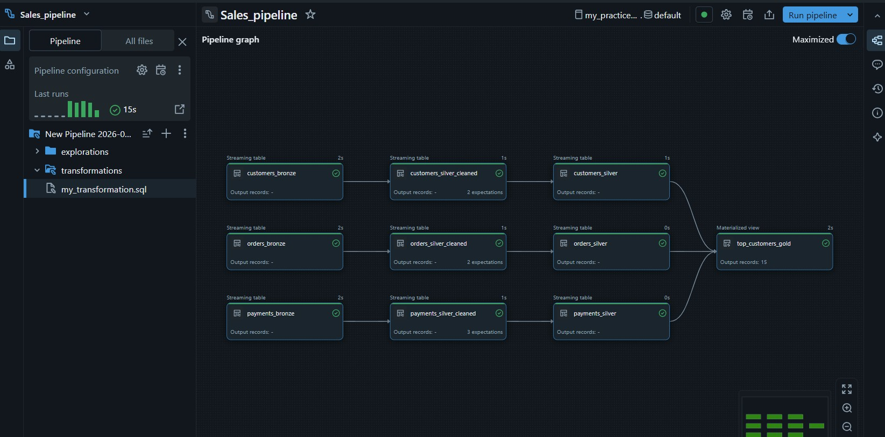
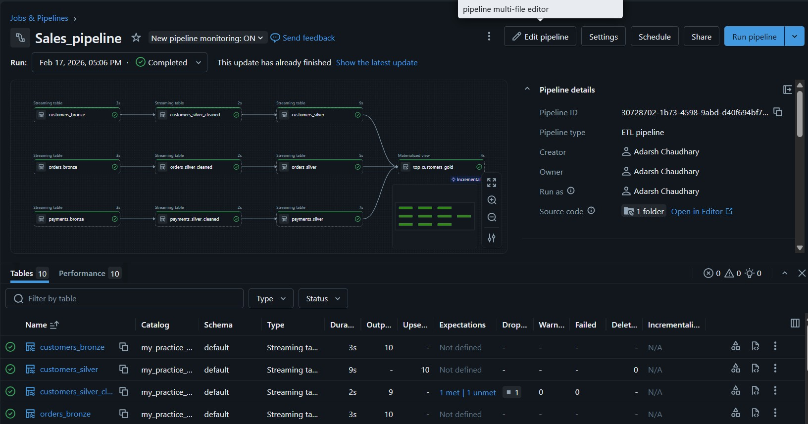

# Azure-Sales-Pipeline 
**ADLS Gen2 → Lakeflow Connect → Databricks Streaming Tables → Gold (Materialized View)**

---

## Project Overview

This project demonstrates a modern **streaming-based data engineering pipeline** built using Azure Databricks Lakehouse Architechture.

The pipeline ingests data from **Azure Data Lake Storage Gen2 (ADLS Gen2)** using **Lakeflow Connect**, processes it using **Databricks Lakeflow Declarative Pipelines**, and produces a **Gold Layer materialized view** for analytics consumption.

This implementation follows Lakehouse principles with incremental processing and streaming tables.

---

## Architecture Flow

1. Data stored in ADLS Gen2
  - Container name - input
      - orders
      - customers
      - payments
2. Lakeflow Connect ingests data into Databricks - using **Auto Loader**
3. Databricks Lakeflow Declarative Pipeline processes streaming data 
4. Streaming tables are created for incremental transformations  
5. Gold layer is generated as a **Materialized View**  

---

## Pipeline structure



```
        ADLS Gen2
             ↓
      Lakeflow Connect
             ↓
   Databricks Streaming Table
             ↓
  Lakeflow Declarative Pipeline
             ↓
  Gold Layer (Materialized View)
```

---

## Technologies Used

- **Azure Data Lake Storage Gen2 (ADLS Gen2)** – Data source
- **Azure Databricks Lakehouse** - Incremental processing
- **Lakeflow Connect** – Data ingestion framework
- **Lakeflow Declarative Pipelines** – Streaming transformation logic
- **Databricks Streaming Tables**
- **SQL Notebooks** – Transformation logic

---

## Pipeline Components

### Data Source (ADLS Gen2)

- Sales data is stored in Azure Data Lake.
- Acts as raw input for streaming ingestion.

---

### Ingestion using Lakeflow Connect

- Lakeflow Connect reads data incrementally.
- Enables structured ingestion into Databricks.
- Supports scalable and managed ingestion patterns.

---

### Streaming Table Creation

Databricks creates streaming tables that:

- Continuously process incoming data
- Maintain incremental state
- Support near real-time transformation

Example :

```sql
CREATE OR REFRESH STREAMING TABLE sales_stream
AS SELECT * FROM cloud_files("<ADLS path on which external location is created>", "csv");
```

---

### Declarative Pipeline Transformations

Using SQL notebooks inside the `transformations` folder:

- Data cleansing
- Filtering invalid records and nulls
- Schema enforcement
- Business aggregations
- KPI derivations

Example Transformation:

```sql
CREATE STREAMING TABLE orders_silver_cleaned (
	CONSTRAINT valid_order EXPECT (orderid is NOT NULL) ON VIOLATION DROP ROW,
	CONSTRAINT valid_customer EXPECT (customerid is NOT NULL) ON VIOLATION DROP ROW	
) as 
SELECT *
FROM STREAM(orders_bronze);
```

---

### Gold Layer – Materialized View

The final output is created as a **Materialized View**, enabling:

- Optimized query performance
- Business-ready aggregated metrics
- Efficient reporting consumption

Example:

```sql
create materialized view top_customers_gold as
select c.customer_id, c.customer_name,
count(distinct(o.orderid)) as total_closed_orders,
sum(o.order_amount) as total_spent,
max(o.orderdate) as last_order_date,
'SUCCESS' as payment_status 
from customers_silver c join orders_silver o 
on c.customer_id = o.customerid
join payments_silver p
on o.orderid = p.order_id
where o.order_status = 'COMPLETED'
and p.payment_status = 'SUCCESS'
group by c.customer_id, c.customer_name;
```

---

## Repository Structure

```
Azure-Sales-Pipeline/

├── transformations/
│   └── my_transformation.sql
├── explorations/
│   └── my_explorations.sql
│
├── datasets/
│
└── README.md
```

---

## Key Design Principles

1. Lakehouse Architecture  
2. Streaming-first design  
3. Incremental processing  
4. Declarative transformations  
5. Scalable and cloud-native  
6. Optimized Gold layer using Materialized Views

---

## Business Outcome

The Gold materialized view enables:

- Fast analytics queries
- Revenue & KPI computation
- Integration with BI tools
- Scalable reporting layer

---

## Author

Adarsh Chaudhary  
Data Engineer | Azure | Databricks | Lakehouse | SQL  

GitHub: https://github.com/addy-10
